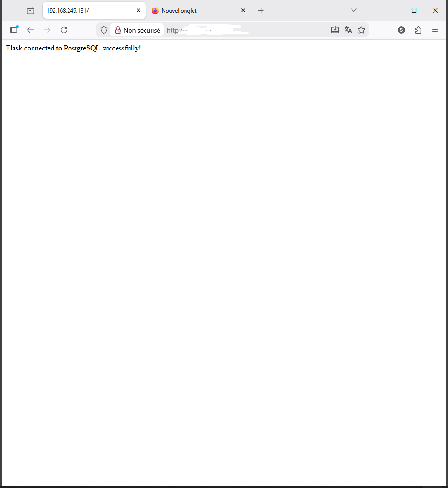
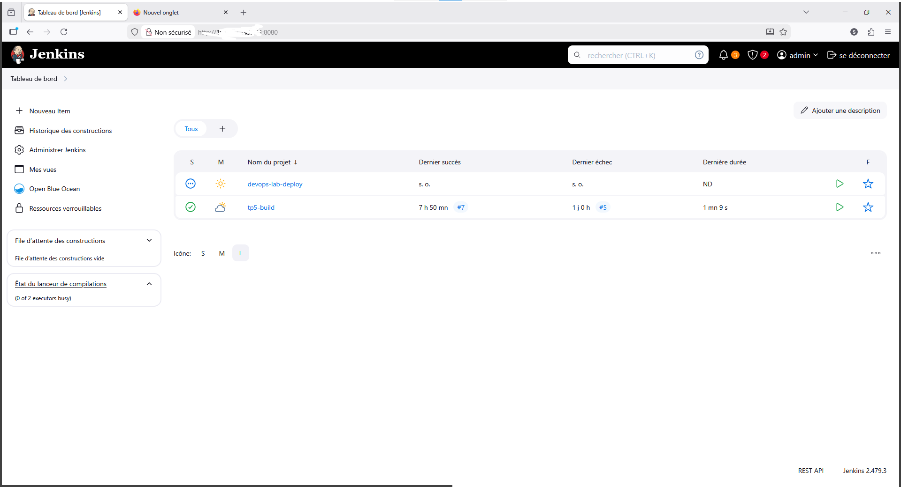
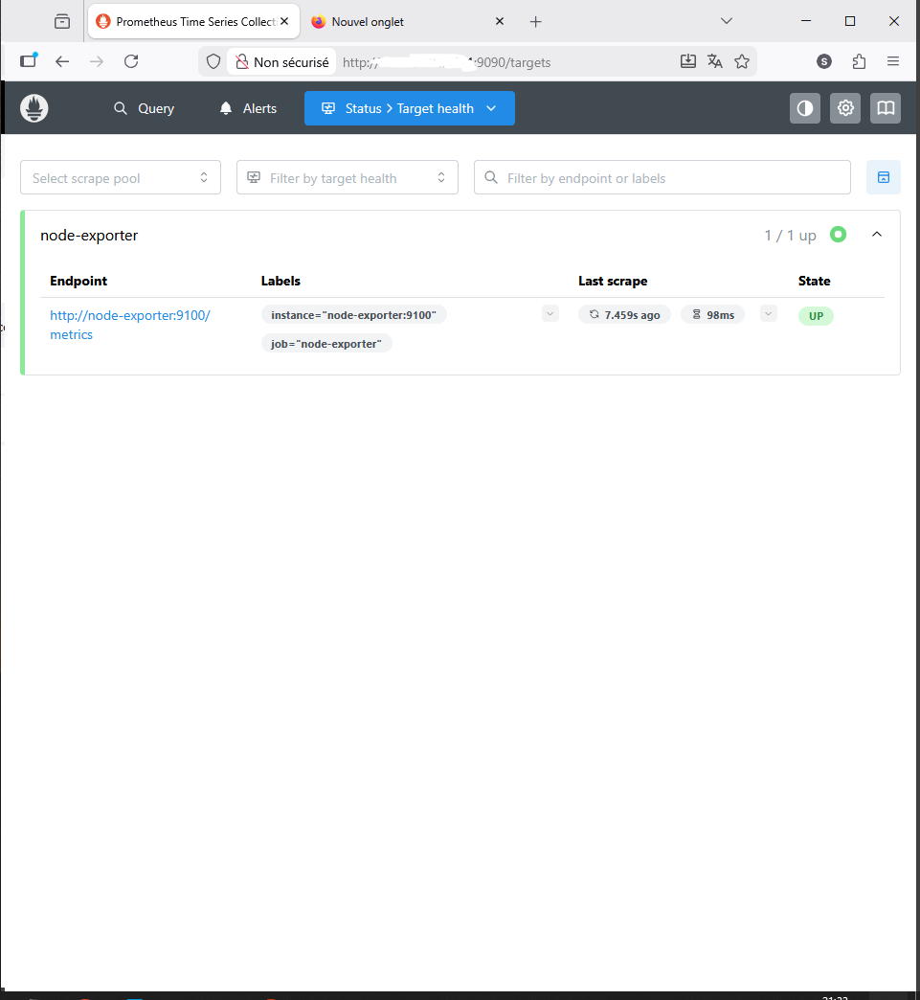
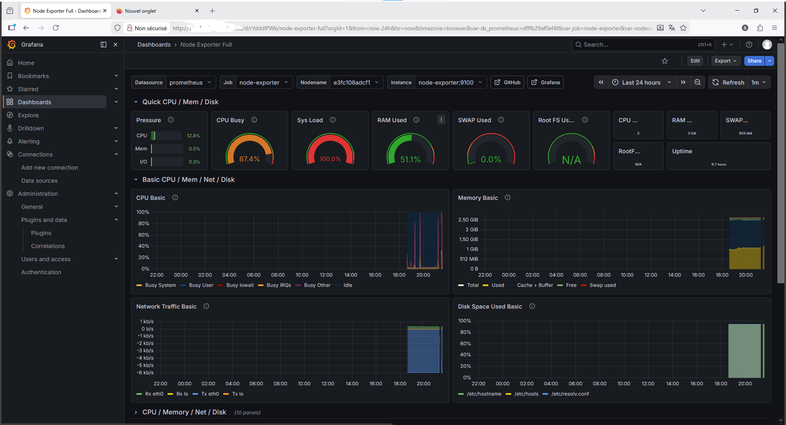

# DevOps CI/CD & Monitoring Lab

## Project Overview

This project demonstrates a simple DevOps platform using containerized services, monitoring tools, and CI/CD automation.

The environment includes:

- A Flask web application
- PostgreSQL database
- NGINX reverse proxy
- Monitoring stack (Prometheus + Grafana)
- CI/CD pipeline with Jenkins
- Docker container orchestration

---

## Architecture

User → NGINX → Flask → PostgreSQL

Monitoring Stack  
Node Exporter → Prometheus → Grafana

CI/CD Pipeline  
GitHub → Jenkins → Docker Build

---

## Technologies Used

- Docker
- Docker Compose
- Flask (Python Web Application)
- PostgreSQL
- NGINX Reverse Proxy
- Prometheus Monitoring
- Grafana Dashboards
- Jenkins CI/CD
- Git & GitHub

---

## Features

- Multi-container microservice architecture
- Reverse proxy configuration
- Container networking
- Persistent PostgreSQL database
- Infrastructure monitoring with Prometheus
- Visualization with Grafana dashboards
- Jenkins CI/CD automation
- Git-based version control

---

## Project Structure
devops-lab
│
├── app
│ └── app.py
│
├── nginx
│ └── nginx.conf
│
├── monitoring
│ └── prometheus.yml
│
├── docker-compose.yml
│
├── screenshots
│ ├── app.png
│ ├── grafana.png
│ ├── prometheus.png
│ ├── jenkins.png
│ └── docker.png
│
└── README.md

---

## Screenshots

### Application Running

### Jenkins CI/CD

### Prometheus Targets

### Grafana Dashboard

### Docker Containers

---

## Future Improvements

- Kubernetes deployment
- Infrastructure as Code (Terraform)
- Cloud deployment on Azure
- Logging stack (ELK)
- Application metrics monitoring

---

## Author

BOUKRICHY SOUFIANE – IIBDCC Student
